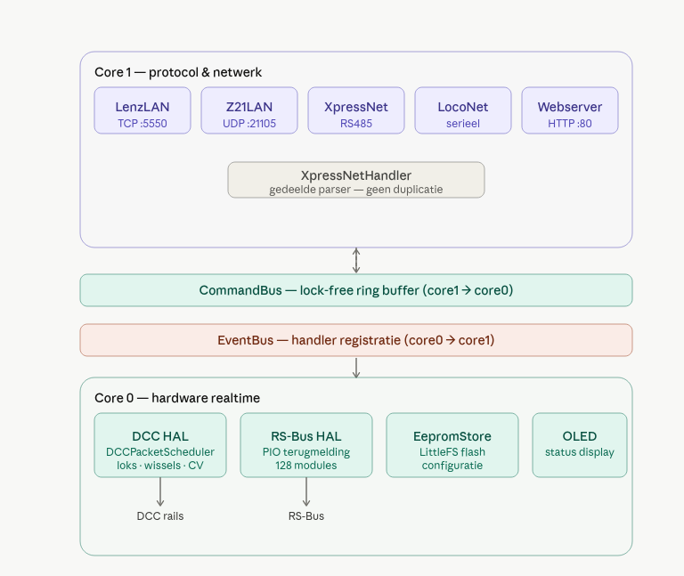

# TMC-LZ210
DCC Command Station. Supports XpressNet and Z21 over Ethernet, Loconet (B and T), XpressNet and RSBus feedback. 

De architectuur van de TMC-LZ210 centrale is opgebouwd met gebruik maken van de dual core functionaliteit van de RP2350 pico 2 microcontroller. Buiten de twee cores wordt er ook gebruik gemaakt van de 3 PIO's voor het realizeren van de  DCC, RSBus en de RS485 xpressnet functionaliteit.

## Core 1 — protocol & netwerk (decodeert protocollen, post Commands) ## 

### LenzLan (lenz_lan.cpp/.h) ###

 TCP-server op poort lenz.port (standaard 5550). Implementeert het Lenz LAN-protocol (LI-LAN/LZ100-stijl) richting o.a. jouw VB6-testclient. Beheert tot lenz.maxconn simultane clients, parseert XpressNet-frames via een eigen XpressNetHandler-instantie (sXpressNet), en stuurt elk antwoord via de centrale _sendRaw()-primitief (1 bericht = 1 TCP-segment ). Doet ook de welcome-broadcast en RS-Bus-dump bij nieuwe connectie.

### LenzUsb (lenz_usb.cpp/.h) ###

 Zelfde protocol als LenzLAN, maar over USB CDC serial in plaats van TCP. Eigen XpressNetHandler-instantie (sUsbXpressNet). Net als LenzLAN nu geconsolideerd rond één _sendRaw()-primitief.

### Z21Lan (z21_lan.cpp/.h) ###

 UDP-server op poort z21.port (21105) voor Z21-compatibele apps (bijv. Z21-app, Rocrail). Eigen XpressNetHandler-instantie (sZ21XpressNet). UDP is inherent atomisch per datagram, dus geen segment-risico zoals bij TCP.

### XpressNetRs485 (xpressnet_rs485.cpp/.h) ###

 De fysieke RS-485 9-bit-adresprotocol-laag voor handhelds (MultiMaus e.d.) direct aan de bus. Doet cyclische polling van slaves, met een apart _progModeActive-pad dat de polling-cyclus wijzigt zodra een handheld een lokdecoder wil programmeren. Eigen XpressNetHandler-instantie (sRs485Handler).

### Webserver (webserver.cpp/.h) ###

 HTTP-configuratie- en monitoring-interface op poort 80. Pure server-side HTML (geen JS), paginering via ?p=<panel>. Toont/bewerkt netwerkinstellingen, module-parameters (DCC, RS-Bus, XpressNet, etc.), loco- en wisseltabellen, en de RS-Bus-feedbacktabel (net gefixt qua filter-logica).
 ### XpressNetHandler (xpressnet_handler.cpp/.h) ###

 Gedeelde laag binnen Core 1: XpressNetHandler is de protocol-agnostische commandoparser/-responsebuilder die door alle vier de bovenstaande modules wordt gebruikt — elk met zijn eigen instantie (geen gedeelde state tussen transporten). Bouwt alleen buffers, doet zelf nooit I/O.

### Verbindingslaag tussen de cores (glue-logic) ###

#### CommandBus (core1→core0) #####
 Lock-free ringbuffer. Protocolmodules posten Commands (snelheid, functies, wissels, CV-programmering) die DccHal uitvoert. Command.sourceId voorkomt dat een module zijn eigen commando terugkrijgt.

#### EventBus (core0→core1) ####
 Lock-free ringbuffer, andere richting. Hardwaremodules publiceren Events (power-status, lopstate-wijzigingen, RS-Bus-feedback, kortsluiting) die naar alle geregistreerde protocolmodules 
 gaan (geen sourceId-filtering, want events zijn bedoeld voor broadcast).

## Core 0 — hardware & realtime ##

### DccHal (dcc_hal.cpp/.h) ### 
 
 Vertaalt CommandBus-commando's naar daadwerkelijke DCC-pakketten via de DCCPacketScheduler-library. Stuurt GP2/GP3 (DCC-signaal + inverse voor de H-bridge) en GP4 (enable). Bevat intern ook DccCurrentMonitor (kortsluit- en ACK-detectie via GP27 — momenteel uitgeschakeld omdat de DRV8871 H-bridge daar hardware-technisch niet geschikt voor is).

### RsBusHal (rs_bus_hal.cpp/.h) ###

 Beheert de RS-Bus-master via een dedicated PIO-kanaal (los van de RS-485 UART). Polt elke 10ms, houdt een _nibble[129][2]-cache en _seen[]-bitmask bij, en publiceert FEEDBACK_BULK-events bij wijzigingen.

### LocoNetModule (loconet_module.cpp/.h) ###
 Wraps de LocoNet2-library (GP0/GP1) en bevat intern een SlotServer (120 LocoNet-slots, FREE→COMMON→IN_USE→IDLE→FREE-lifecycle), die loc-state leest uit LocoRepository en wijzigingen via CommandBus/EventBus doorgeeft.

### OledDisplay (oled_display.cpp/.h) ###
 Statusscherm, toont systeeminfo (IP, power-status, etc).

## Gedeelde data (beide cores shared data) ##

### LocoRepository (loco_repository.cpp/.h) ###
 De centrale loc-state-tabel (snelheid, richting, functies F0-F68, momentary-vlaggen, LocoNet-slotkoppeling). Door beide cores benaderbaar via lock/unlock (spinlock), gebruikt door alle protocolmodules, DccHal en SlotServer.

### EepromStore (eeprom_store.cpp/.h) ###
 Persistente key-value-opslag via LittleFS op flash (vervangt EEPROM). Bewaart alle configuratieparameters; webserver leest/schrijft via dezelfde API als de modules zelf.