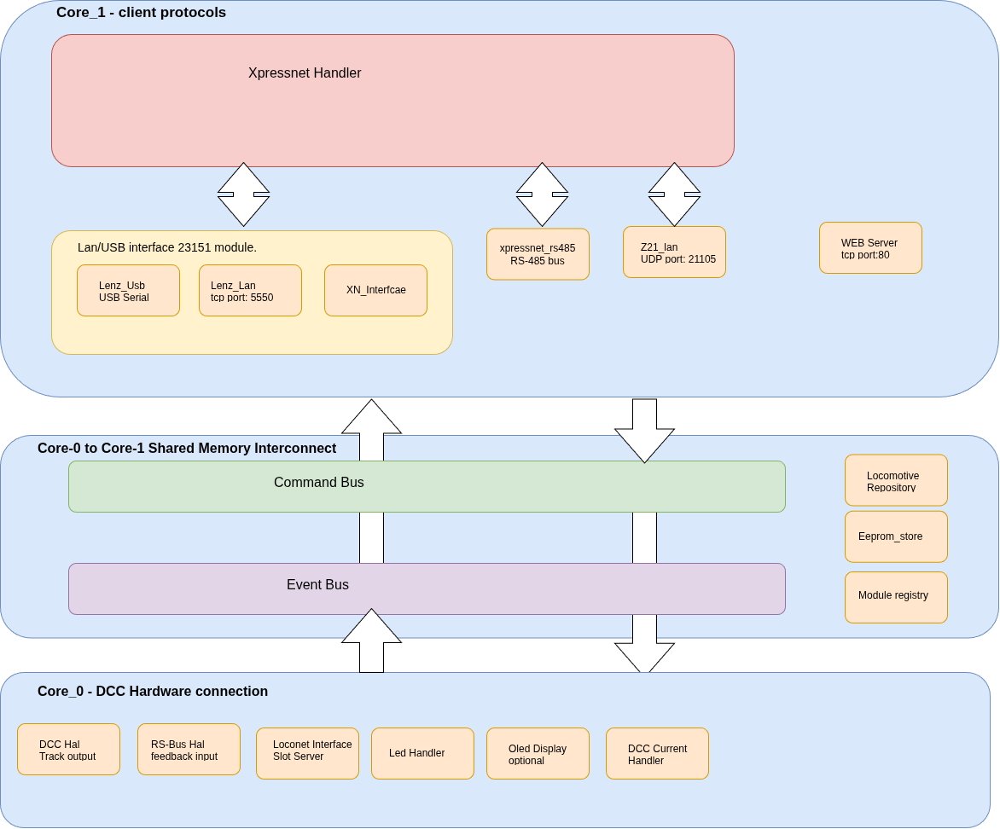

# TMC-LZ210

The TMC-LZ210 is a DCC Command Station. It supports the following functions: the DCC protocol via the normal DCC output, the DCC protocol via a CDE booster output, and the DCC protocol via a LocoNet booster. Furthermore, it supports various communication interfaces, i.e. XpressNet over LAN/USB, XpressNet via RS-485, and the Z21 protocol via a UDP LAN interface. A web server provides the possibility to configure several command-station-specific configuration parameters. For feedback support, an RS-Bus interface is present for handling a maximum of 128 feedback decoders.

The architecture of the TMC-LZ210 command station is built around the dual-core functionality of the RP2350 Pico 2 microcontroller. 

Three high-level main modules can be identified:

- **The Core 1 networking and client protocol module:**

  This high-level module is responsible for communication with clients like Rocrail, iTrain, etc. The Core-1 networking module consists of the following modules:

  - **The XpressNet handler:**
    Responsible for handling the XpressNet version 4.0 message protocol. The XpressNetHandler is the HW-independent command parser and response builder used by all four modules of the available HW protocol modules, each with their own XpressNetHandler instance to handle their messages. its an Shared layer within Core 1. 

  - **The LAN/USB interface  23151 module:**
    The Lan/USB interface module implements partly the logic of the Lenz LAN/USB-23151 interface module. Only the Lan/USB site is implemented because it runs completely on the commandstation so no RS-485 interface is present or needed. 
    It consists of three modules:

    - **The xn_interface module:**
      
      Handles the common messages for the interface — the messages that are local to the Lenz 23151 module — and provides functions to send XpressNet messages via LAN and USB.
      

    - **The Lenz LAN module:**
      
      Handles all xpressnet LAN communication. it provides for a TCP server on port  5550.

    - **The Lenz USB module:**
     
      Handles the single USB Serial interface.

  - **The XpressNet RS-485 master interface module:**

    Physical RS-485 9-bit address protocol layer for handheld controllers (such as the MultiMaus) connected directly to the bus. 
    Handles the communication with all connected XpressNet devices. It performs cyclic polling of slave devices every address, maximum number of 32,  it send and receive the message to/from the clients.  Message from the xpressnet handler wil be send/broadcasted to the client while received message will be stript the polling protocol headers and passes the remaining messages to the xpressnet handler.

  - **The Z21 LAN module:**
    
    The Z21 module provides Z21-compatible communication with the LZ210. It handles most Z21 messages. However, received wrapped XpressNet messages are passed to the XpressNet handler for futher processing. Message it which are sent via the xpressnet handler will be converted to plain Z21 messages and send/broadcasted to the clients.

  - **The web server:**

    HTTP configuration and monitoring interface on port 80. Pure server-side HTML (no JavaScript), with page selection through ?p=<panel>. Displays and edits network settings, specific module parameters  for the LZ210 (DCC, RS-Bus, XpressNet, etc.), locomotive and turnout tables, and the RS-Bus feedback table.
    
- **The Core 0 ↔ Core 1 shared-memory interconnect module:**

  The Core 0 / Core 1 interconnect is the shared-memory communication path between Core 0 and Core 1, made thread-safe. It consists of the command bus, for communication from Core 1 to Core 0, and the event bus, for communication the other way around. The EEPROM handler and the locomotive repository are also part of this layer, because they need to be accessible from both cores.

  - **The CommandBus module (Core1 → Core0):** 

    The commandbus module handles the shared memory communication from core-1 to core -0. Its a Lock-free ring buffer. The xpressnet-Handler module post Commands (speed, functions, turnouts, CV programming) that are executed by DccHal. 

  - **The EventBus module (Core0 → Core1)** 

    The EventBus mdoule handels the shared memory communication between core-0 and core-1. It is a Lock-free ring buffer in the opposite direction. Hardware modules publish Events (power status, locomotive state changes, RS-Bus feedback, short circuits) that are distributed to all registered protocol modules. The events are intended for broadcast.

  - **The LocoRepository module:** 

    The central locomotive state table containing speed, direction, functions F0–F68, momentary flags, and LocoNet slot associations. Accessible from both cores through lock/unlock (spinlock) mechanisms and used by all protocol modules, DccHal, and SlotServer.

  - **The EepromStore module:**

    Persistent key-value storage using LittleFS on flash memory (replacing traditional EEPROM). Stores all configuration parameters. The webserver reads and writes through the same API used by the modules themselves.

- **The Core 0 DCC hardware connection module:**

  The Core 0 DCC hardware connection module contains the following modules:

  - **DCC-HAL module:**

    The DCC-HAL module Translates CommandBus commands into actual DCC packets through the DCCPacketScheduler library, which is responsible the generation of the DCC signal. The DCC-HAL

  - **RS-Bus module:**

    The RS-Bus HAL module uses the RS-Master library for the communication with the feedback modules. It Polls every 10 ms the RS-Bus library to see if new feedback events are occured, maintains a _nibble[129][2] cache , and publishes FEEDBACK_BULK events whenever changes are detected. Accoding to the RS-Bus specification a total ammount of 128 feedback modules are supported providing for  1024 different feedback points.

  - **The LocoNet interface module:**
    
    the Loconet Interfcae module Wraps the LocoNet2 library ) and internally contains a SlotServer (120 LocoNet slots with a FREE → COMMON → IN_USE → IDLE → FREE lifecycle). Reads locomotive state from LocoRepository and propagates changes through CommandBus and EventBus.
    At this moment it handles only the communication with the FREMO Fred handheld. No other interfaces to LocoNet devices are  for the moment foreseen. The Loconet interface supported is based on the Personel edition 1999 specification only.

  - **The LED handler:**

    A generic class that handles all control of the on-board LEDs. At the moment there is an LED for the status of the command station, which flashes when a short circuit is detected. The LED handler is also used for LEDS indicating traffic on the Ethernet interface, the RS-Bus interface  and the DCC  interface.

  - **The Oled Display Handler:**
    
    Th Oled display handler is used for communicating with the optional Oled display via I2C. Currently it provides basic initialisation information but is futher not used for displaying system information. This module is optional.

  - **The DCC Current Handler module:**

    The DCC Current handler is reponsible for the detection of an shortcircuit on the DCC interface and for the detection of an ACk pulse during programming a decoder. Currently this is deactivated due to hardware issues.

