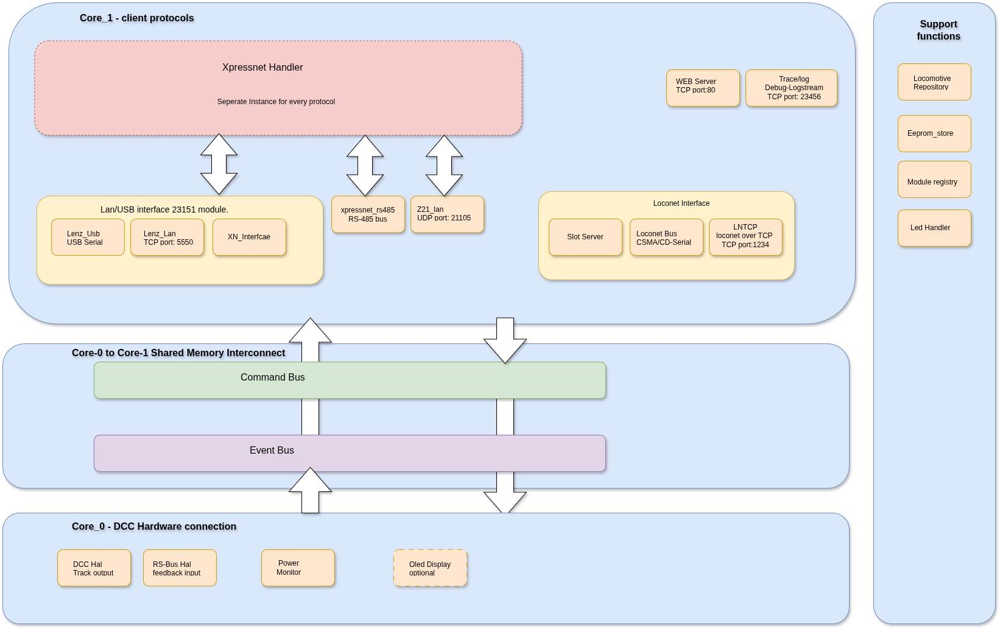
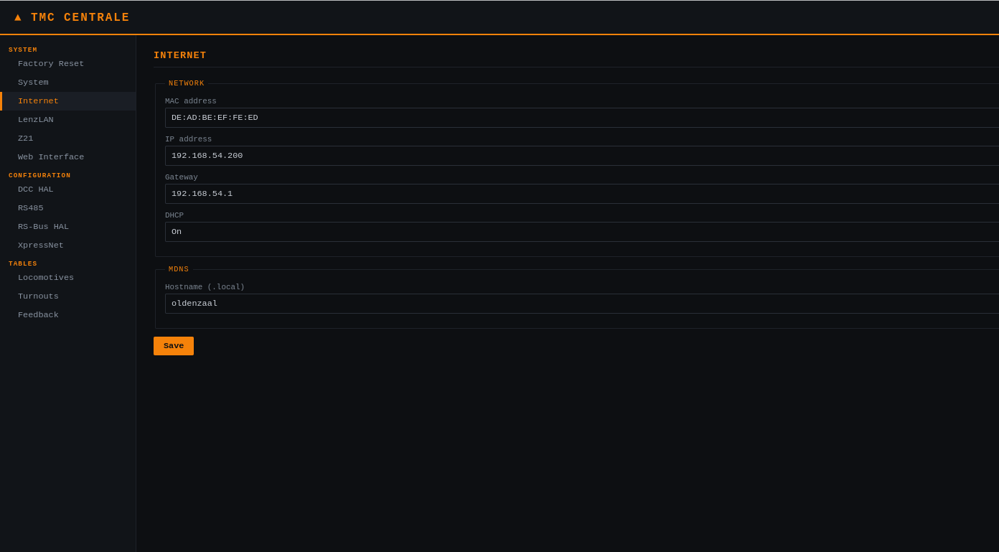

# TMC-LZ210

The TMC-LZ210 is a DCC Command Station. It supports the following functions: the DCC protocol via the normal DCC output, the DCC protocol via a CDE booster, and the DCC protocol via a LocoNet booster. Furthermore, it supports various communication interfaces, i.e. XpressNet over LAN/USB, XpressNet via RS-485, the Z21 protocol via a UDP LAN interface, and loconet over TCP interface. A web server provides the possibility to configure several command-station-specific configuration parameters. For feedback support, an RS-Bus interface is present for handling a maximum of 128 feedback decoders.
## content
* [1. Software Architecture](#software-architecture)
* [2. Development Environment](#development-environment)
* [3. First time Use](#first-time-use)


## Software Architecture

 The Architecture described  in here is based upon the Hardware version-2. The architecture of the TMC-LZ210 command station is built around the dual-core functionality of the Olimex RP2350B XL  Pico 2 microcontroller. Core-1 handles the external communication interfaces. The communication protocols implemented are: xpressnet over TCP, xpressnet over USB, xpressnet over RS-485, Z21 protocol over UDP, Loconet oevr Serial-CMSA/CD and Loconet over TCP. COre-0 handles the HW interfaces wich are directly related to train control like DCC, RS-BUS. Also some support functies ie. power monitoring and oled communication. In order to communicate between Core-0 and Core-1 a shared amemory interconnect is implemented to make this safely possible. The picture below provides the overview of the architecture.

[](images/Architecture_Version2_LZ210.png)

Four high-level main modules can be identified in the picute above :

- **The Core 1 networking and client protocol module:**

  This high-level module is responsible for communication with clients like Rocrail, iTrain, etc. The Core-1 networking module consists of the following modules:

  - **The XpressNet handler:**
    Responsible for handling the XpressNet version 4.0 message protocol. The XpressNetHandler is the HW-independent command parser and response builder used by all four modules of the available HW protocol modules, each with their own XpressNetHandler instance to handle their messages. its an Shared layer within Core 1. 

  - **The LAN/USB interface  23151 module:**
    The Lan/USB interface module implements partly the logic of the Lenz LAN/USB-23151 interface module. Only the Lan/USB site is implemented because it runs completely on the commandstation so no RS-485 interface is present or needed. 
    It consists of three modules:

    - **The xn_interface module:**
      
      Handles the common messages for the interface — the messages that are local to the Lenz 23151 module — and provides functions to send XpressNet messages via LAN and USB. Other messages will be passed to the associated xpressnet instance for futher handling. 
      

    - **The Lenz LAN module:**
      
      Handles all xpressnet LAN communication. it provides for a TCP server on port  5550.

    - **The Lenz USB module:**
     
      Handles all xpressnet communication over a single USB Serial interface.

  - **The XpressNet RS-485 master interface module:**

    Physical RS-485 9-bit address protocol layer for handheld controllers (such as the MultiMaus) connected directly to the bus. 
    Handles the communication with all connected XpressNet devices. It performs cyclic polling of slave devices every address, maximum number of 32,  it send and receive the message to/from the clients.  Message from the xpressnet handler wil be send/broadcasted to the client while received message will be stript the polling protocol headers and passes the remaining messages to the xpressnet handler.

  - **The Z21 LAN module:**
    
    The Z21 module provides Z21-compatible communication with the LZ210. It handles most Z21 messages. However, received wrapped XpressNet messages are passed to the XpressNet handler for futher processing. Message it which are sent via the xpressnet handler will be converted to plain Z21 messages and send/broadcasted to the clients.

  - **The web server:**

    The web Server is a simple HTTP configuration and monitoring interface on port 80. Pure server-side HTML (no JavaScript), with page selection through ?p=<panel>. Displays and edits network settings, specific module parameters  for the LZ210 (DCC, RS-Bus, XpressNet, etc.), locomotive and turnout tables, and the RS-Bus feedback table.
    
  - **The LocoNet interface module:**
    
     The Loconet interface supported is based on the Personel edition 1999 specification only. It consists of three modules the slotserver, the loconet bus handler and the loconet tcp handeler.

    - **The SLot Server:**
      The Slot Server internally contains a SlotServer (120 LocoNet slots with a FREE → COMMON → IN_USE → IDLE → FREE lifecycle). Reads locomotive state from LocoRepository and propagates changes through CommandBus and EventBus.It also sends message through the two loconet interfaces.

    - ** Loconet Bus  module Wraps the LocoNet2 library, which handles the loconet communication via de Serial protocol with CSMA/CD

  - **The Trace/Log module:**
     
     The Trace/log module provides for debug logging information over a TCP connection. It provides the developer with an indepth view of the LZ210's operation.  The follwoing types of trace groups are identified: DEBUG, INFO, WARNING and ERROR. The Trace/Log module can be configured via the web interface. Here a specific debug level can be set and several debug modules kan be enabled or disabled to do  basic filtering of messages.


- **The Core 0 ↔ Core 1 shared-memory interconnect module:**

  The Core 0 / Core 1 interconnect is the shared-memory communication path between Core 0 and Core 1, made thread-safe. It consists of the command bus, for communication from Core 1 to Core 0, and the event bus, for communication the other way around. The EEPROM handler and the locomotive repository are also part of this layer, because they need to be accessible from both cores.

  - **The CommandBus module (Core1 → Core0):** 

    The commandbus module handles the shared memory communication from core-1 to core -0. Its a Lock-free ring buffer. The xpressnet-Handler module post Commands (speed, functions, turnouts, CV programming) that are executed by DccHal. 

  - **The EventBus module (Core0 → Core1)** 

    The EventBus mdoule handels the shared memory communication between core-0 and core-1. It is a Lock-free ring buffer in the opposite direction. Hardware modules publish Events (power status, locomotive state changes, RS-Bus feedback, short circuits) that are distributed to all registered protocol modules. The events are intended for broadcast.

- **The Core 0 DCC hardware connection module:**

  The Core 0 DCC hardware connection module contains the following modules:

  - **DCC-HAL module:**

    The DCC-HAL module Translates CommandBus commands into actual DCC packets through the DCCPacketScheduler library, which is responsible the generation of the DCC signal. The DCC-HAL

  - **RS-Bus module:**

    The RS-Bus HAL module uses the RS-Master library for the communication with the feedback modules. It Polls every 10 ms the RS-Bus library to see if new feedback events are occured, maintains a _nibble[129][2] cache , and publishes FEEDBACK_BULK events whenever changes are detected. Accoding to the RS-Bus specification a total ammount of 128 feedback modules are supported providing for  1024 different feedback points.
  
  - **The Oled Display Handler:**
    
    Th Oled display handler is used for communicating with the optional Oled display via I2C. Currently it provides basic initialisation information but is futher not used for displaying system information. This module is optional.

  - **The Power Monitor:**

  The Power Monitor monitors the three power rails available in the LZ210. During power-up a check will be done if power is available on all three power rails. When in Operational mode the status of the power rails kan be checked via the associated web page.
 
 - **The support functions:**

  - **The LocoRepository module:** 

    The central locomotive state table containing speed, direction, functions F0–F68, momentary flags, and LocoNet slot associations. Accessible from both cores through lock/unlock (spinlock) mechanisms and used by all protocol modules, DccHal, and SlotServer.

  - **The EepromStore module:**

    Persistent key-value storage using LittleFS on flash memory (replacing traditional EEPROM). Stores all configuration parameters. The webserver reads and writes through the same API used by the modules themselves.

  - **The LED handler:**

    A generic class that handles all control of the on-board LEDs. At the moment there is an LED for the status of the command station, which flashes when a short circuit is detected. The LED handler is also used for LEDS indicating traffic on the Ethernet interface, the RS-Bus interface  and the DCC  interface.
 
  - ** The Module Registery:**

    The module Registery is a central, single-instance lifecycle manager for all ModuleBase-derived modules. Every module registers itself with it once at startup (add()); the registry then drives begin()/loop() on each module on its correct core (beginCore0()/loopCore0() vs. beginCore1()/loopCore1()), and detects GPIO pin and PIO state-machine conflicts between modules at registration time, before anything runs. It also acts as a simple directory (find()/isRegistered()) so any module can look up another registered module by ID.


## Development Environment

The development environment used to write the LZ210 Software is the Arduino IDE 2.3.10. The connection to the hardware can be a simple USB connection to the RP-2350 microprocessor, and image transfer kan be done via UF2 format. In this situation the boot button on the RP-2350 should be pressed when connecting the USB cable. Then the PC wil see the RP-2350 as a external storage device and the UF2 formatted image can be uploaded to the processor. Another means to upload the image is to use a Raspberry PI Debug Probe, then the upload method used should be set to Picoprobe/Debugprobe ( CMSIS - DAP) in the ide tool menu.

The board package that has to be selected is the Raspberry PI Pico/RP2040/RP2350 by Earl Philhower, III and in the tools menu of the ide the board type must be set to Raspberry PI Pico 2.

Another setting which has to be made in the Arduino IDE in the tools menu is the flash size 4MB (Sketch: 3968 KB / FS 128KB). This because the eeprom simulation is implemented as a tiny filesystem.

### Libraries

The LZ210 software depends on several available Libraries, inorder to build the image the following libraries should be available:

- **The standard Ethernet Library**

  The standard Etnernet library is available in the installed library package, so it doesn't have to be installed seperately.

- **The EthernetBonjour Library**

  The LZ210 supports mDNS functionality which is implemented via the EthernetBonjour library, therefore this library needs to be installed. The library can be found in the library configurator of the arduino IDE.

- **The RS-Bus Master library**
  
  This library is provided in the repositories of the github of Aiko Pras: https://github.com/aikopras/RSbusMaster.git. It handles the communication with the RS-Bus feedback decoders.

- **The Loconet2-master-TMC library**

  This library can be found in the repositories on the github page of TMC-Digiboys: https://github.com/tmc-digiboys/Loconet2-Master-TMC.git. The Loconet2-TMC library implements the basic communication with the Loconet interface. This library is used by the Loconet module of the LZ210. The interfcae implemented is based upon the loconet personall edition At this moment only the FREMO FREDS are supported.

- **The DCCInterfaceMaster-TMC library**

    This library implements the DCC interface of the LZ210. This library should be configured to use de RP 2040 in the variants- Z21PG. 

- **The Embedded Template Library ( ETL ) by John Wellbelove**

  This library provides for templates which are used in the loconet2-TMC-master library.


### Main Ino file

The main ino file for the LZ210 is provided in the repsoitory. This file defines the compleet functionality of the LZ210. 
This file is needed for the LZ210 software. Some configuration can be done in this ino file to configure the configuration of the LZ210.

### RP2350 Hardware functions

The Raspberry PI RP-2350 supports several hardware functions below is a description which hardware function is used for a LZ210 functionality. Pin Assignement for the hardware function can be found in the hardware_config.h file.

- In the LZ210 three Serial ports are used:
  - Serial:   For the onboard usb interface.
  - Serial1:  Used for the Loconet Interface.
  - Serial2:  Used as debug port special header is provided on the PCB

- The RP2350 has three seperate PIO available all these PIOs are currently in use in the LZ210:

  - PIO 0 is in use in the DCCInterface Master-TMC library to realize a correct stable DCC signal. for more info see the description of the library.
  - PIO 1 is in use in the RS-Bus master library to implement the rsbus interface for communication to the RS-Bus decoders. More information can be
    found in the library.
  - PIO 2 is in use in the Xpressnet RS485 module to implement a 9-bits Uart for the communication with the slave devices.

- One of the onboard ADC channel is used for the detection of a shortcircuit on the DCC signal and for the etection of een DCC Ack pulse as a reposne of a programming action. However due to hardware related issues this is currently disbaled and not working.

### Software Versions

There will be at least two versions, Version-1 and version-2. Version-1 is developed for the first LZ210 hardware, which is only used for internal testing purposes. Version-2 will be made available when the version-2 hardware becomes available, Some modifications need to be made to provide for full functionality of the version-2 hardware.  Version_1 software can not be used on the TMC-LZ210 Hardware described in the TMC-LZ210-Command-station-PCB repository without modification. For the latest board the Version-2 Software should be used. 
Further development will only be done on version-2 software, and bug fix releases will be available.

## Software Configuration

There are two configuration options available.

- Compile time configuration;
- Runtime configuration;

### Compile time configuration.

The LZ210 software is build around modules. These modules are dynamical enabled in the code ( LZ210.ino file) as shown below:

```CPP
 // ── Register modules ───────────────
    bool r0 = registry().add(&gOled);
    bool r1 = registry().add(&EepromStore::instance());
    
    bool r2  = registry().add(&gDccHal);
    bool r2b = registry().add(&gRsBusHal);
    
    bool r3 = registry().add(&gLenzLan);
    bool r4 = registry().add(&gLenzUsb);
    bool r5 = registry().add(&gZ21Lan);
    bool r6 = registry().add(&gXpressNetRs485);
    bool r7 = registry().add(&gWebserver);
    bool r8 = registry().add(&gLocoNet);
```
    
The LZ210 will during its Start-up phase register the selected functions. By removing a function it will not be enabled during start-up. Keep in mind that the code is still available compile-time but it will not be executed.

### Runtime configuration

The LZ210 provides a webserver where several configuration parameters kan be changed. 

[](images/webpagina.png)

The figure above provides an example of the webpage. In the figure kan be seen that several entries are foreseen:

- **system**

  - Factory reset
  - System 
  - Internet
  - LenzLan
  - Loconet-over_TCP
  - Z21
  - Web interface
  - Debug Log

- **Configuration**

  - DCC-HAL
  - Power rails
  - RSbus-HAL
  - Xpressnet

- **Tables**

  - Locomotives
  - Loconet Slots
  - Turnouts
  - Feedback

The Last entry, the tables, provides information about the locomotives, Loconet Slots,  Turnouts, and the Feedback decoders. No Configuration is possible here, it is only possible to clear the lists. See the website itself for detailed configuration parameters.

## First Time Use

The LZ210 Version-2 Hardware is build around the olimex Pico2 XL development board, therefore this board should be selected in as the board for the LZ210 in the tools menu from the arduino IDE. Use is made of the board package that has to be selected is the **olimex Pico2 XL by Earl Philhower, III**.
The LZ210 also uses a file system for the flash storage of configuration parameters, therefore this should be configured in the arduino-ide as well.  In the Arduino IDE select **Tools - Flash Size** and select minimal **2MB(Sketch: 1920KB, FS: 128KB)**. In order to operate normally, the **Tools - CPU Speed:** should be set **150 MHz**, no overclocking is used nor required. Setting the clock speed to a different value will cause erratic behavior.

During the first LZ210 starts-up it will store default configuration values in the flash filesystem. These configuration parameters can later be modified in the webpages. The configuration parameters will be described in a seperate document.

When the power is connected to the LZ210, the builtin LED and the red status LED will start flashing indicating the LZ210 is starting-up. After Start-up, the LZ210 enters the power-off mode. In order to bring the LZ210 to the operation state, a power-on command should be given via either a ROCO multimouse or a Lenz LH100 handheld. In Fact it should be possible to use any Handheld connected via Xpressnet RS-485, but only these two are tested. Another way to set the LZ210 in the operational mode is connecting a PC via the available ethernet connector, and use a program like RocRail to send a Power-On command with  Xpressnet over TCP, Xpressnet over USB or Z21 connection. In case the LZ210 is in a operatioonal mode the red status LED and the builtin LED will burn steady. In this case the LZ210 is sending its DCC SIgnals over the DCC main Port and the booster ports. The state, Power-on or power-off,  in which the LZ210 starts-up is configurable via the website. 

The LZ210 board provides several LEDS. The red late is the general status led. Other leds provide information if communication protocols are used, i.e if DCC traffic is present, Xpressnet traffic is ongoing, etc.  See the board Layout for the meeaning of the LEDs. ( due to a miscalculation in the hardware version 2 and 2.1 , the DCC  function is handled by the xpressnet LED as well and the red LED is STATUS, this will be solved in the next revision of the Hardware)

The LZ210 has a serial debug port. Connecting a serial to USB converter to this port, with the following parameters Baudrate 112500, databits 8 , no parity, some logging is performed on a local terminal like putty or the provided QT tracelog program. Another way to receive extended information from the LZ210 is by using a terminal program like putty in raw mode on port 23456. Thsi provides access to the trace/LOG function of the LZ210. detailed information on the internal functions of the LZ210. Several parameters to control this function can be changed on the Debug Log page of the LZ210.